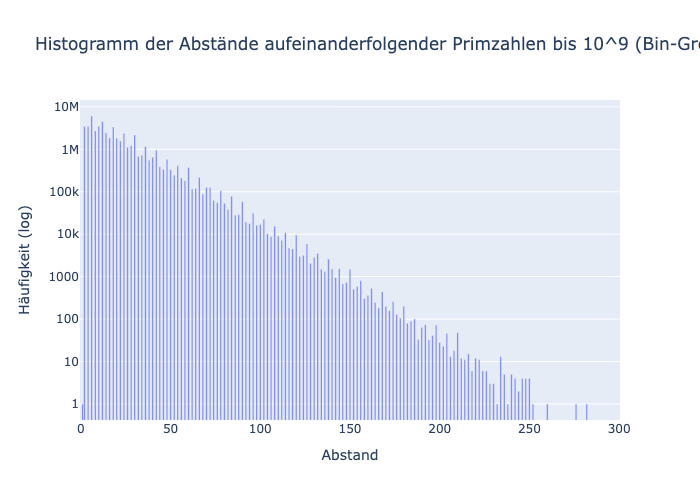

# Prime Gaps Analysis

This project analyzes the distribution of gaps between consecutive prime numbers up to a specified limit.

## Mathematical & Algorithmic Background

### Mathematical Background
The **Prime Number Theorem** states that the average gap between primes near $x$ is approximately $\ln(x)$. However, the distribution of these gaps is much more complex. This project investigates the **frequencies of specific gap sizes** (e.g., how often do we see a gap of 2, 4, 6, etc.).

For gaps between consecutive primes $p_n$ and $p_{n+1}$, where $d_n = p_{n+1} - p_n$:
*   **Twin Primes:** Correspond to a gap of 2.
*   **Cousin Primes:** Correspond to a gap of 4.
Sexy Primes: Correspond to a gap of 6.
The distribution displays patterns related to primorials ($n\#$), where gaps that are multiples of small primes occur significantly more frequently.

### Algorithmic Implementation

- **Sieve of Eratosthenes:** Instead of testing each number for primality, the script uses the Sieve of Eratosthenes, which is $O(N \log \log N)$.
- **Gap Calculation:** Uses `np.diff(primes)`, a vectorized NumPy function that computes the difference between adjacent elements, making it extremely fast.

### Optimizations
- **Vectorization (NumPy):** The primary optimization is the use of `numpy`. By shifting from Python loops to `numpy` arrays, operations are performed in compiled C.
- **Logarithmic Scaling:** The histogram uses a log-scaled Y-axis. This is necessary because the frequency of prime gaps decays exponentially with gap size; without the log scale, large gaps would be invisible.

## Features

- **Efficient Sieve:** Implements the Sieve of Eratosthenes.
- **Gap Calculation:** Calculates the gaps between consecutive primes.
- **Visualization:** Generates interactive HTML histograms (using Plotly) and static PNG exports.
- **Auto-Browser:** Automatically opens the generated HTML visualization in your default browser.

## Visualization

The following histogram illustrates the distribution of prime gaps up to $10^9$:



## Prerequisites

- Python 3
- [uv](https://github.com/astral-sh/uv) (for package management)

## Setup

1. Install dependencies:
   ```bash
   uv install
   ```

2. Run the analysis:
   ```bash
   python3 plot_prime_gaps.py
   ```

## Files

- `plot_prime_gaps.py`: Main script for calculation and plotting.
- `prime_gaps_histogram_1e9.html`: Interactive visualization.
- `prime_gaps_histogram_1e9.png`: Static visualization.
